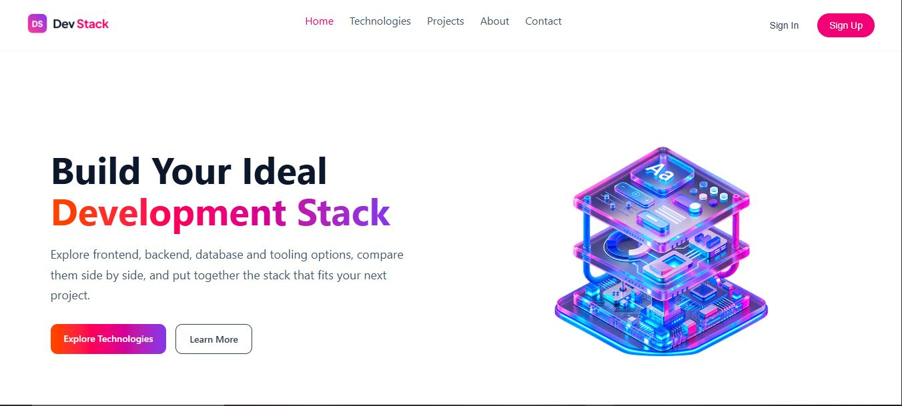
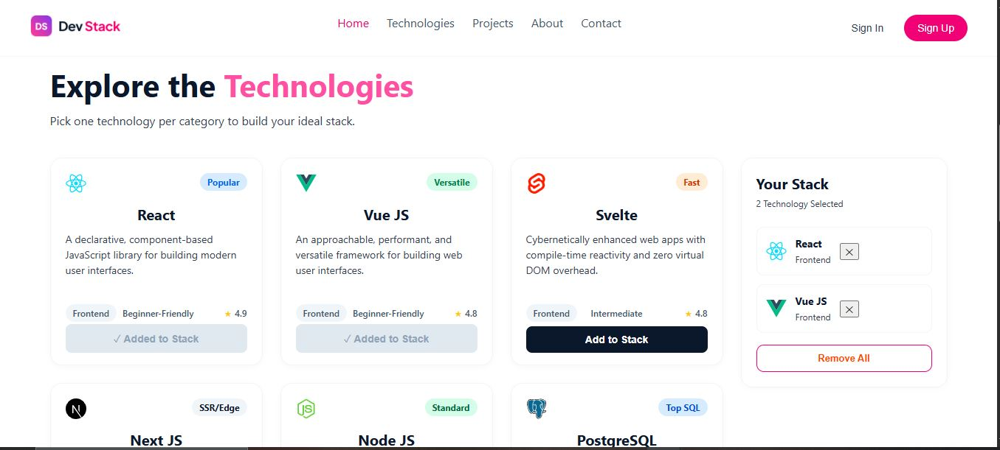
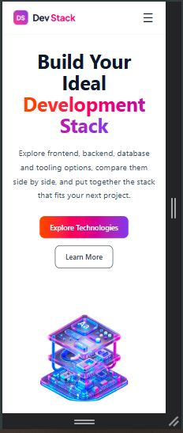

# 🚀 Dev Stack

### Build Your Ideal Development Stack

Dev Stack is a responsive React application that helps developers explore modern technologies and build a personalized development stack.

<p align="center">
  <a href="YOUR_LIVE_PAGE_URL">
    <strong>🌐 View Live Website</strong>
  </a>
</p>

---

## ✨ About the Project

**Dev Stack** is designed to make technology exploration simple and interactive.

Users can explore frontend, backend, database, and tooling technologies, view their details, and add their preferred technologies to a personalized **Your Stack** section.

The project also includes responsive design, mobile navigation, stack management, loading state, and interactive notifications.

---

## 🎯 Features

### 🔎 Explore Technologies

Each technology card includes:

* Technology icon
* Category
* Difficulty level
* Rating
* Description
* Technology badge

### 🧩 Build Your Stack

Users can:

* Add technologies to their stack
* Prevent duplicate selections
* Remove individual technologies
* Remove all selected technologies
* See selected technologies update dynamically

### 🔔 Toast Notifications

React-Toastify is used for:

* Successful stack additions
* Duplicate add attempts
* Removing technologies
* Removing all technologies

### 📱 Responsive Design

The website is optimized for desktop and mobile screens with:

* Responsive hero section
* Mobile hamburger navigation
* Single-column technology cards on smaller screens
* Responsive stack panel
* Mobile-friendly footer

---

## 🛠️ Technologies Used

<p>
  
  
  
  
  
  
</p>

---

## 🖼️ Project Preview

### 🖥️ Desktop

<p align="center">
  
</p>

### 🧩 Technologies & Stack

<p align="center">
  
</p>

### 📱 Mobile

<p align="center">
  
</p>

---

## ⚛️ React Concepts Practiced

This project helped me practice:

* Functional components
* JSX
* `useState`
* `useEffect`
* Conditional rendering
* Event handling
* Array `.map()`
* TypeScript types
* JSON data handling
* Responsive CSS
* React-Toastify

---

## ❓ React Questions & Answers

### 1. What is JSX, and why is it used in React?

JSX is a syntax extension that allows us to write HTML-like code inside JavaScript or TypeScript. React uses JSX to describe the structure of the user interface.

### 2. What is the difference between State and Props?

**State** is data managed inside a component that can change over time. **Props** are values passed from a parent component to a child component.

### 3. What is the `useState` hook, and how does it work?

`useState` is a React Hook used to create and manage state in a functional component. It returns the current value and a setter function used to update that value.

### 4. How can you share state between components in React?

State can be moved to the closest common parent component and then passed to child components through props. This technique is commonly called **lifting state up**.

### 5. What is conditional rendering in React?

Conditional rendering means displaying different UI depending on a condition. React commonly uses `if` statements, the ternary operator, and logical operators for this.

### 6. What is the purpose of `useEffect` in React?

`useEffect` is used for side effects such as timers, API calls, subscriptions, and other operations that should happen after rendering.

### 7. Why should we not mutate state directly in React?

React uses state updates to determine when the UI should re-render. Directly mutating state can prevent React from properly detecting the change. Instead, we should create a new value and update the state using its setter function.

---

## 📂 Project Structure

```text
B14-A05-DevStack/
├── assets/
│   ├── desktop.jpg
│   ├── mobile.jpg
│   └── technologies.jpg
│
├── src/
│   ├── assets/
│   ├── data/
│   │   └── technologies.json
│   ├── types/
│   ├── App.tsx
│   ├── App.css
│   └── main.tsx
│
├── package.json
└── README.md
```

---

## 💡 What I Learned

Building Dev Stack gave me practical experience with React state management, TypeScript, JSON-based data, conditional rendering, event handling, responsive CSS, and interactive UI design.

The project also helped me understand how multiple React concepts can work together to create a complete, functional application.

---

## 👩‍💻 Author

### Sayda Sheikh
Aspiring Full-Stack Developer who enjoys learning, building, solving problems, and growing through every project.

---

<p align="center">
  <strong>Built with React, TypeScript & ☕</strong>
</p>

<p align="center">
  ⭐ Thanks for visiting Dev Stack!
</p>
